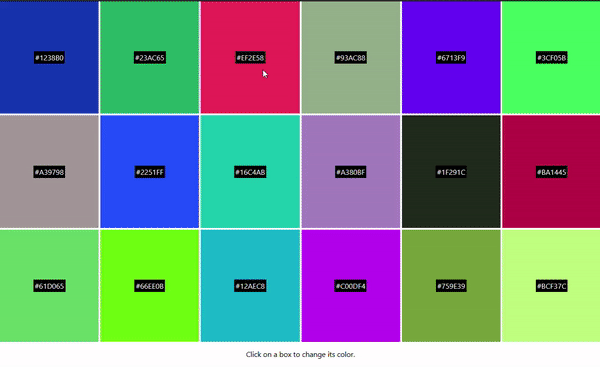

# color-boxes-react

18 boxes display random colors that change when clicked.

To check out the project...

> Clone / Download zip

> run "npm install" (will require node and npm)

> run "npm start"

Feedback is appreciated. Thank you!
